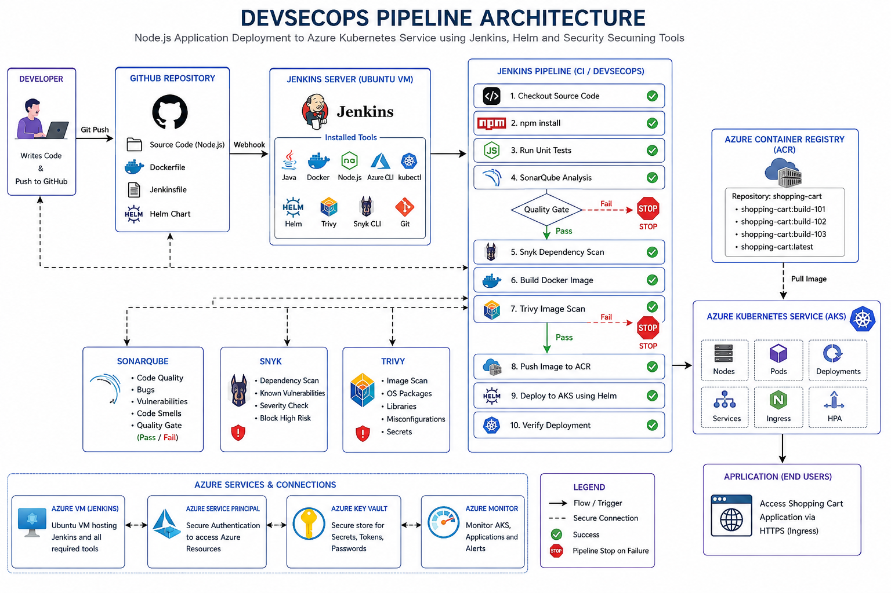

# 🚀 DevSecOps Pipeline for Node.js Shopping Cart Application on Azure Kubernetes Service (AKS)


---

# 📌 Project Overview

This project demonstrates an **end-to-end DevSecOps CI/CD Pipeline** for deploying a **Node.js Shopping Cart Application** to **Azure Kubernetes Service (AKS)**.

The pipeline automates application build, testing, security scanning, containerization, image storage, and deployment using **Jenkins, Docker, Azure Container Registry (ACR), Azure Kubernetes Service (AKS), Helm, SonarQube, Snyk, and Trivy**.

The primary objective is to ensure that **only secure, tested, and approved code is deployed to production**.

---

# 🎯 Project Objectives

* Build an automated DevSecOps CI/CD Pipeline
* Deploy a Node.js Shopping Cart Application on AKS
* Perform Static Code Analysis using SonarQube
* Scan Dependencies using Snyk
* Scan Docker Images using Trivy
* Push Images to Azure Container Registry (ACR)
* Deploy Applications using Helm
* Configure Kubernetes Ingress
* Configure Horizontal Pod Autoscaler (HPA)
* Automate Deployment using GitHub Webhooks and Jenkins

---

# 🏗 Project Architecture

The following architecture illustrates the complete DevSecOps workflow from source code commit to deployment on Azure Kubernetes Service.

<p align="center">
  
</p>

---

## 🔄 Architecture Workflow

```text
Developer
      │
      ▼
GitHub Repository
      │
GitHub Webhook
      │
      ▼
Jenkins Pipeline
      │
      ├── Checkout Source Code
      ├── npm Install
      ├── Unit Tests
      ├── SonarQube Analysis
      ├── Quality Gate
      ├── Snyk Dependency Scan
      ├── Docker Image Build
      ├── Trivy Image Scan
      ├── Push Image to Azure Container Registry
      ├── Connect to AKS
      ├── Helm Deployment
      └── Deployment Verification
      │
      ▼
Azure Kubernetes Service
      │
Ingress Controller
      │
      ▼
Shopping Cart Web Application
```

---

# 📖 Architecture Explanation

1. The **Developer** develops the Node.js Shopping Cart Application.
2. The application source code is pushed to the **GitHub Repository**.
3. A **GitHub Webhook** automatically triggers the Jenkins pipeline.
4. Jenkins checks out the source code and installs the required Node.js dependencies.
5. The application tests are executed.
6. **SonarQube** performs static code analysis and validates the Quality Gate.
7. **Snyk** scans the Node.js dependencies for security vulnerabilities.
8. Jenkins builds a Docker image.
9. **Trivy** scans the Docker image for vulnerabilities.
10. The approved Docker image is pushed to **Azure Container Registry (ACR)**.
11. Jenkins authenticates to Azure using a **Service Principal**.
12. **Helm** deploys or upgrades the application in **Azure Kubernetes Service (AKS)**.
13. Kubernetes creates the required Pods, Services, Ingress, and HPA.
14. The application is exposed to end users through the Kubernetes Ingress Controller.

---

# 🛠 Technology Stack

| Category                   | Technologies                   |
| -------------------------- | ------------------------------ |
| Cloud Platform             | Microsoft Azure                |
| Source Control             | Git, GitHub                    |
| CI/CD                      | Jenkins                        |
| Programming Language       | Node.js                        |
| Web Framework              | Express.js                     |
| Containerization           | Docker                         |
| Container Registry         | Azure Container Registry (ACR) |
| Container Orchestration    | Azure Kubernetes Service (AKS) |
| Kubernetes Package Manager | Helm                           |
| Static Code Analysis       | SonarQube                      |
| Dependency Security        | Snyk                           |
| Container Security         | Trivy                          |
| Kubernetes CLI             | kubectl                        |
| Cloud CLI                  | Azure CLI                      |

---

# ☁ Azure Resources

| Azure Resource           | Purpose                        |
| ------------------------ | ------------------------------ |
| Resource Group           | Organizes Azure resources      |
| Ubuntu Virtual Machine   | Hosts Jenkins Server           |
| Azure Container Registry | Stores Docker Images           |
| Azure Kubernetes Service | Hosts Kubernetes workloads     |
| Virtual Network          | Secure networking              |
| Network Security Group   | Controls network access        |
| Public IP Address        | Provides external connectivity |

---

# 🔐 DevSecOps Security Controls

* ✅ Static Code Analysis using SonarQube
* ✅ SonarQube Quality Gate Validation
* ✅ Dependency Vulnerability Scanning using Snyk
* ✅ Docker Image Vulnerability Scanning using Trivy
* ✅ Secure Azure Authentication using Service Principal
* ✅ Jenkins Credentials for Secure Secret Management

---

# 📂 Repository Structure

```text
DevSecOps-NodeJS-ShoppingCart-AKS/
│
├── app/
├── docker/
│   └── Dockerfile
├── docs/
│   ├── architecture/
│   │   └── devsecops-architecture.png
│   └── screenshots/
├── helm/
│   ├── Chart.yaml
│   ├── values.yaml
│   └── templates/
├── jenkins/
│   └── Jenkinsfile
├── kubernetes/
├── scripts/
├── .gitignore
└── README.md
```

---

# 🚦 Jenkins Pipeline Stages

* Source Code Checkout
* Install Node.js Dependencies
* Execute Unit Tests
* SonarQube Code Analysis
* SonarQube Quality Gate Verification
* Snyk Dependency Scan
* Docker Image Build
* Trivy Image Scan
* Push Docker Image to Azure Container Registry
* Authenticate with Azure
* Validate Helm Chart
* Deploy Application to AKS
* Verify Pods, Services, Ingress, and Application Availability

---

# 📈 Expected Outcome

Every GitHub code push automatically performs the following:

* Builds the Node.js application
* Executes application tests
* Performs static code analysis
* Scans dependencies
* Builds a Docker image
* Scans the Docker image
* Pushes the approved image to Azure Container Registry
* Deploys the application to Azure Kubernetes Service using Helm
* Verifies Pods, Services, Ingress, and Application availability

---

# 📸 Project Documentation

The complete implementation will include:

* Architecture Diagram
* Azure Infrastructure Setup
* Jenkins Installation
* SonarQube Configuration
* Snyk Integration
* Docker Build Process
* Trivy Scan Results
* Azure Container Registry Configuration
* Azure Kubernetes Service Deployment
* Helm Chart Configuration
* Kubernetes Ingress
* Horizontal Pod Autoscaler
* End-to-End Jenkins Pipeline Execution
* Final Application Deployment

---

# 👨‍💻 Author

**Ahmad Mushabbir**

**Azure DevOps | DevSecOps | Microsoft Azure | Docker | Kubernetes | Jenkins | CI/CD**

---

# 📄 License

This repository is created for learning, demonstration, and DevSecOps portfolio purposes.
